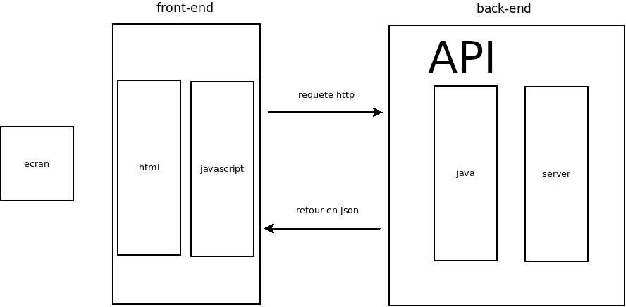
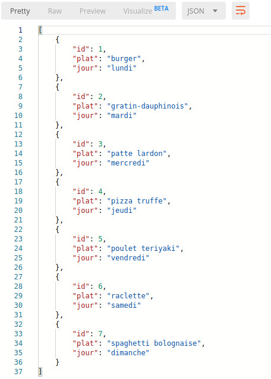

# bouffe

Description:

Une appli qui m'affiche un plat et et sa photo en fonction du jour.

## __Fonctionnement__:

l'appli permet fait juste des requetes sur le back End.

Pour la partie Ajout il faut passer par un logiciel tel que postman ou faire les requetes directements sur l'url.

## __Mes end-points__:

- http://localhost:8080/bouffe/titre

        Permet de recupérer le titre en string.

- http://localhost:8080/bouffe/donne
  
        Renvoie un des objets au hazard.

- http://localhost:8080/bouffe/montrelesplats
  
        Renvoie un listing de tous les objets.

- http://localhost:8080/bouffe/ajoute

        Rajoute un objet.

- http://localhost:8080/bouffe/objetPlat

        Recherche un objet par son id.

## __exemple de requetes__: 

http://localhost:8080/bouffe/montrelesplats génère:

Renvoie la liste des plats au format JSON.

